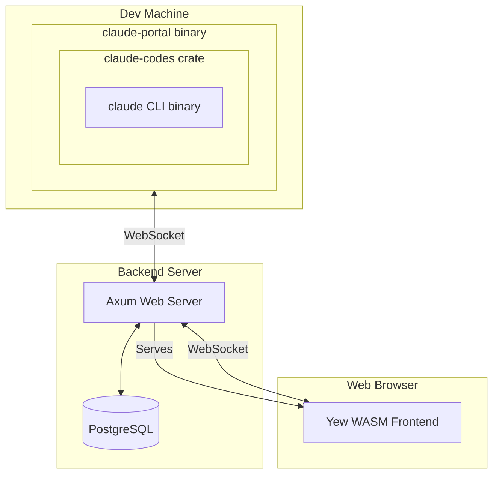

# Claude Code Portal

A web portal that extends [Claude Code](https://docs.anthropic.com/en/docs/claude-code) with session sharing, remote access, and collaborative features. Run Claude Code on powerful machines and access it from anywhere through your browser.

## Try It Out

**Live Demo**: [txcl.io](https://txcl.io)

Sign in with Google to get started - your sessions are isolated and secure. This public instance is open to anyone.

## Features

- **Remote Access**: Run Claude Code on dedicated machines, access from any browser
- **Session Sharing**: Share sessions with team members for collaborative coding
- **Voice Input**: Dictate commands using browser-based speech recognition
- **Persistent History**: All conversations stored and accessible across devices
- **Flexible Authentication**: Configure for single-user, organization-only, or public access
- **Real-time Sync**: Multiple viewers see updates instantly via WebSocket

## Use Cases

- **Hardware Development**: Develop against specialized hardware (GPUs, FPGAs, embedded devices) from any laptop
- **Powerful Workstations**: Run Claude Code on beefy machines while traveling with a thin client
- **Mobile Development**: Code from your phone or tablet - the web UI works on any device
- **Team Collaboration**: Share Claude sessions for pair programming or code review
- **Long-Running Tasks**: Start a task, walk away, check results later from any device
- **Consistent Environment**: Keep your dev environment on one machine, access it everywhere

## Deployment Modes

Claude Code Portal supports different authentication configurations:

| Mode | Use Case | Configuration |
|------|----------|---------------|
| **Single User** | Personal server | Restrict to your Google account |
| **Organization** | Team/company | Limit to specific email domain |
| **Public** | Open access (like txcl.io) | Allow any Google account |

See [Google OAuth Configuration](#google-oauth-configuration) for setup details.

## Quick Start

```bash
# Clone the repository
git clone https://github.com/meawoppl/claude-code-portal.git
cd claude-code-portal

# Start everything (auto-installs dependencies)
./scripts/dev.sh start
```

Then open: **http://localhost:3000/**

You'll be automatically logged in as `testing@testing.local` in dev mode.

## Architecture



The **portal** refers to the complete system: backend server, web frontend, and CLI binary. The CLI binary (`claude-portal`) connects your local Claude Code instance to the portal server, enabling remote access and session sharing.

### Components

| Component | Description |
|-----------|-------------|
| **Backend** | Axum web server with PostgreSQL, OAuth, WebSocket coordination |
| **Frontend** | Yew WebAssembly app with terminal-style UI and voice input |
| **CLI** | `claude-portal` binary that wraps Claude Code and connects to backend |
| **Shared** | Common types and protocol definitions (WASM-compatible) |

## Usage

### Web Interface

1. Open the portal URL in your browser
2. Sign in with Google
3. View your active Claude Code sessions
4. Click any session to interact with Claude
5. Use the microphone button or `Ctrl+M` for voice input

### Running the CLI

On your development machine:

```bash
claude-portal \
  --backend-url wss://your-portal.com \
  --session-name "my-dev-machine"
```

On first run, the CLI displays a verification URL and code for OAuth authentication. Credentials are cached in `~/.config/claude-code-portal/config.json`.

### Voice Commands

The web interface supports voice input for hands-free coding:

- Click the microphone icon or press `Ctrl+M` to start recording
- Speak your command naturally
- Click again or press `Ctrl+M` to stop and send
- Works in Chrome, Edge, and other browsers with Web Speech API support

## Google OAuth Configuration

To deploy your own instance, you need Google OAuth credentials:

### 1. Create a Google Cloud Project

1. Go to [Google Cloud Console](https://console.cloud.google.com/)
2. Create a new project or select an existing one
3. Enable the **Google+ API** (for user info)

### 2. Configure OAuth Consent Screen

1. Navigate to **APIs & Services > OAuth consent screen**
2. Choose **External** (or **Internal** for Google Workspace orgs)
3. Fill in the required fields:
   - App name: Your portal name
   - User support email: Your email
   - Developer contact: Your email
4. Add scopes: `email`, `profile`, `openid`
5. Add test users if in testing mode

### 3. Create OAuth Credentials

1. Navigate to **APIs & Services > Credentials**
2. Click **Create Credentials > OAuth client ID**
3. Application type: **Web application**
4. Add authorized redirect URIs:
   - `https://your-domain.com/auth/google/callback`
   - `http://localhost:3000/auth/google/callback` (for development)
5. Save the **Client ID** and **Client Secret**

### 4. Configure Environment Variables

Create a `.env` file or set environment variables:

```bash
GOOGLE_CLIENT_ID=your-client-id.apps.googleusercontent.com
GOOGLE_CLIENT_SECRET=your-client-secret
GOOGLE_REDIRECT_URI=https://your-domain.com/auth/google/callback

# Optional: Restrict access to specific email domain
# ALLOWED_EMAIL_DOMAIN=yourcompany.com

# Optional: Restrict to specific email addresses
# ALLOWED_EMAILS=user1@gmail.com,user2@gmail.com
```

### Access Control Options

| Variable | Effect |
|----------|--------|
| No restrictions | Any Google account can sign in |
| `ALLOWED_EMAIL_DOMAIN=company.com` | Only `@company.com` emails allowed |
| `ALLOWED_EMAILS=a@x.com,b@y.com` | Only listed emails allowed |

## Documentation

| Document | Description |
|----------|-------------|
| [Development Guide](docs/DEVELOPING.md) | Setting up dev environment, building, testing |
| [Deployment Guide](docs/DEPLOYING.md) | Production deployment, configuration |
| [Docker Guide](DOCKER.md) | Docker-based deployment |
| [Troubleshooting](TROUBLESHOOTING.md) | Common issues and solutions |

## Platform Support

| Platform | Status |
|----------|--------|
| Linux (x86_64) | Tested |
| macOS (Apple Silicon) | Builds in CI |
| macOS (Intel) | Builds in CI |
| Windows (x86_64) | Builds in CI |

Pre-built binaries available from [GitHub Releases](https://github.com/meawoppl/claude-code-portal/releases/latest).

## Technologies

- **Backend**: [Axum](https://github.com/tokio-rs/axum) 0.7, [Diesel](https://diesel.rs/) 2.2, [Tokio](https://tokio.rs/)
- **Frontend**: [Yew](https://yew.rs/) 0.21, WebAssembly
- **Claude Integration**: [claude-codes](https://crates.io/crates/claude-codes)
- **Voice**: Web Speech API

## Contributing

Contributions are welcome! Please:

1. Fork the repository
2. Create a feature branch
3. Run `cargo test` and `cargo clippy`
4. Submit a pull request

Please open an issue first to discuss major changes.

## License

MIT License - see [LICENSE](LICENSE) file for details

## Support

- **Issues**: [GitHub Issues](https://github.com/meawoppl/claude-code-portal/issues)
- **Discussions**: [GitHub Discussions](https://github.com/meawoppl/claude-code-portal/discussions)
