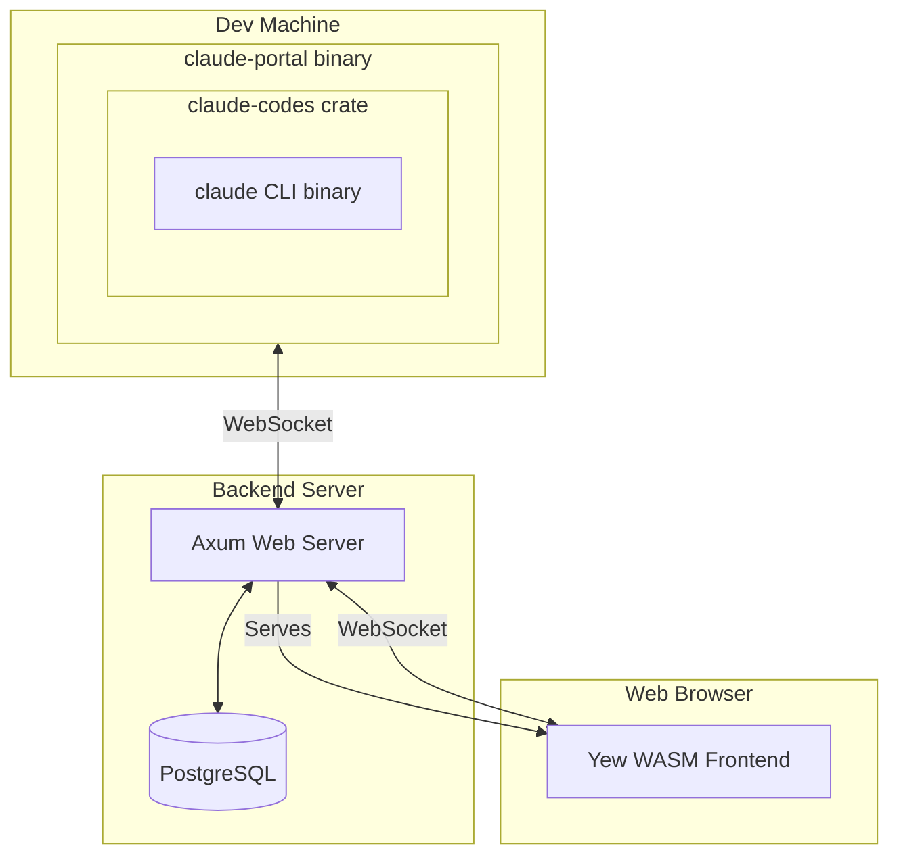

# claude-code-portal

A web-based portal for Claude Code sessions, enabling remote access to Claude Code running on dedicated computers through a beautiful web interface.

## Try It Out

**Live Demo**: [txcl.io](https://txcl.io)

You can try claude-code-portal right now at [txcl.io](https://txcl.io). Sign in with Google to get started - your sessions are isolated and secure.

## Overview

claude-code-portal allows you to:
- Run Claude Code on a powerful remote machine
- Access it from anywhere via a web browser
- Share sessions across multiple clients
- Maintain persistent chat history
- Authenticate securely with Google OAuth

Perfect for teams with dedicated AI workstations or for accessing your home setup while traveling.

## Architecture



### Workspace Structure

This project consists of four Rust crates:

| Crate | Description |
|-------|-------------|
| **shared** | Common types and message definitions (WASM-compatible) |
| **backend** | Axum web server with PostgreSQL/Diesel, OAuth, WebSocket coordination |
| **frontend** | Yew WebAssembly application with terminal-style UI |
| **proxy** | CLI wrapper for `claude` binary with device flow OAuth |

## Quick Start

```bash
# Clone the repository
git clone https://github.com/meawoppl/claude-code-portal.git
cd claude-code-portal

# Start everything (auto-installs dependencies)
./scripts/dev.sh start
```

Then open: **http://localhost:3000/**

You'll be automatically logged in as `testing@testing.local`

See [Development Guide](docs/DEVELOPING.md) for more details.

## Usage

### Web Interface

1. Open the web interface at your deployed URL
2. Sign in with Google
3. View active Claude Code sessions
4. Click any session to interact with Claude

### Running the Portal

On your development machine:

```bash
claude-portal \
  --backend-url wss://your-domain.com \
  --session-name "my-dev-machine"
```

On first run, the portal will display a verification URL and code for OAuth authentication. Credentials are cached in `~/.config/claude-code-portal/config.json`.

## Documentation

| Document | Description |
|----------|-------------|
| [Development Guide](docs/DEVELOPING.md) | Setting up dev environment, building, testing |
| [Deployment Guide](docs/DEPLOYING.md) | Production deployment, configuration |
| [Docker Guide](DOCKER.md) | Docker-based deployment |
| [Troubleshooting](TROUBLESHOOTING.md) | Common issues and solutions |
| [Proxy Auth](PROXY_AUTH.md) | Authentication flow details |

## API Reference

### HTTP Endpoints

| Method | Path | Description |
|--------|------|-------------|
| GET | `/` | Health check |
| GET | `/auth/google` | Initiate OAuth flow |
| GET | `/auth/google/callback` | OAuth callback |
| GET | `/auth/me` | Get current user |
| POST | `/auth/device/code` | Request device code |
| POST | `/auth/device/poll` | Poll for auth completion |
| GET | `/api/sessions` | List user's sessions |
| GET | `/api/sessions/:id` | Get session details |

### WebSocket Endpoints

| Endpoint | Description |
|----------|-------------|
| `/ws/session` | Portal connection (Claude Code to backend) |
| `/ws/client` | Browser connection (real-time updates) |

### Message Protocol

```rust
enum ProxyMessage {
    Register { session_name, auth_token, working_directory },
    ClaudeOutput { content },
    ClaudeInput { content },
    Heartbeat,
    Error { message },
    SessionStatus { status },
}
```

## Technologies

- **Backend**: [Axum](https://github.com/tokio-rs/axum) 0.7, [Diesel](https://diesel.rs/) 2.2, [Tokio](https://tokio.rs/)
- **Frontend**: [Yew](https://yew.rs/) 0.21
- **Claude Integration**: [claude-codes](https://crates.io/crates/claude-codes)

## Platform Support

| Platform | Status |
|----------|--------|
| Linux (x86_64) | Tested |
| macOS (Apple Silicon) | Untested (builds in CI) |
| macOS (Intel) | Untested (builds in CI) |
| Windows (x86_64) | Untested (builds in CI) |

Pre-built binaries available from [GitHub Releases](https://github.com/meawoppl/claude-code-portal/releases/latest).

## Contributing

Contributions are welcome! Please:

1. Fork the repository
2. Create a feature branch
3. Run `cargo test` and `cargo clippy`
4. Submit a pull request

Please open an issue first to discuss major changes.

## License

MIT License - see [LICENSE](LICENSE) file for details

## Support

- **Issues**: [GitHub Issues](https://github.com/meawoppl/claude-code-portal/issues)
- **Discussions**: [GitHub Discussions](https://github.com/meawoppl/claude-code-portal/discussions)
