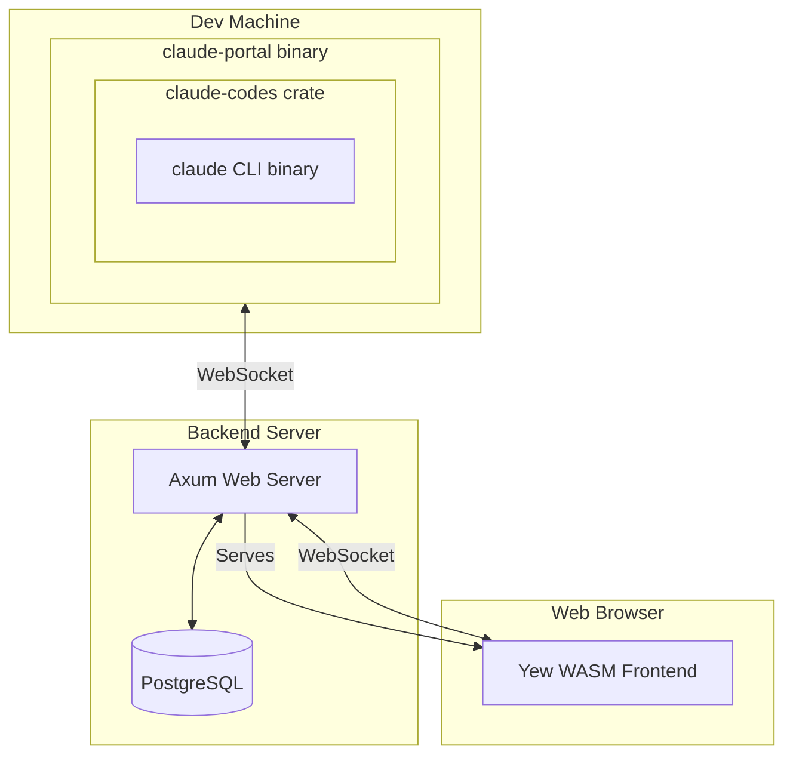

# Claude Code Portal — Try It: [txcl.io](https://txcl.io)

A web portal that extends [Claude Code](https://docs.anthropic.com/en/docs/claude-code) with session sharing, remote access, and collaborative features. Run Claude Code on powerful machines and access it from anywhere through your browser.

## Features

- **Remote Access**: Run Claude Code on dedicated machines, access from any browser
- **Session Sharing**: Share sessions with team members for collaborative coding
- **Voice Input**: Dictate commands using browser-based speech recognition
- **Persistent History**: All conversations stored and accessible across devices
- **Flexible Authentication**: Configure for single-user, organization-only, or public access
- **Real-time Sync**: Multiple viewers see updates instantly via WebSocket
- **VS Code Integration**: Use Claude Code in VS Code while sessions appear on the portal dashboard

## Use Cases

- **Hardware Development**: Develop against specialized hardware (GPUs, FPGAs, embedded devices) from any laptop
- **Powerful Workstations**: Run Claude Code on beefy machines while traveling with a thin client
- **Mobile Development**: Code from your phone or tablet - the web UI works on any device
- **Team Collaboration**: Share Claude sessions for pair programming or code review
- **Long-Running Tasks**: Start a task, walk away, check results later from any device
- **Consistent Environment**: Keep your dev environment on one machine, access it everywhere

## Quick Start

```bash
# Clone the repository
git clone https://github.com/meawoppl/claude-code-portal.git
cd claude-code-portal

# Start everything (auto-installs dependencies)
./scripts/dev.sh start
```

Then open: **http://localhost:3000/**

You'll be automatically logged in as `testing@testing.local` in dev mode.

See [Local Development](docs/LOCAL_DEVELOPMENT.md) for more details on the dev script and available commands.

## Architecture



The **portal** refers to the complete system: backend server, web frontend, and CLI binary. The CLI binary (`claude-portal`) connects your local Claude Code instance to the portal server, enabling remote access and session sharing.

### Components

| Component | Description |
|-----------|-------------|
| **Backend** | Axum web server with PostgreSQL, OAuth, WebSocket coordination |
| **Frontend** | Yew WebAssembly app with terminal-style UI and voice input |
| **CLI** | `claude-portal` binary that wraps Claude Code and connects to backend |
| **Shared** | Common types and protocol definitions (WASM-compatible) |

## Documentation

| Document | Description |
|----------|-------------|
| [Usage Guide](docs/USAGE.md) | Web interface, CLI options, voice input, session sharing |
| [Local Development](docs/LOCAL_DEVELOPMENT.md) | Quick setup with `dev.sh`, available commands |
| [Development Guide](docs/DEVELOPING.md) | Full dev workflow, building, testing, contributing |
| [Deployment Guide](docs/DEPLOYING.md) | Production deployment, Google OAuth setup, configuration |
| [Docker Guide](docs/DOCKER.md) | Docker and Kubernetes deployment with 1Password |
| [VS Code Setup](docs/VSCODE_SETUP.md) | Use Claude Code in VS Code with portal integration |
| [Troubleshooting](TROUBLESHOOTING.md) | Common issues and solutions |

## Platform Support

| Platform | Status |
|----------|--------|
| Linux (x86_64) | Tested |
| macOS (Apple Silicon) | Builds in CI |
| macOS (Intel) | Builds in CI |
| Windows (x86_64) | Builds in CI |

Pre-built binaries available from [GitHub Releases](https://github.com/meawoppl/claude-code-portal/releases/latest).

## Technologies

- **Backend**: [Axum](https://github.com/tokio-rs/axum) 0.7, [Diesel](https://diesel.rs/) 2.2, [Tokio](https://tokio.rs/)
- **Frontend**: [Yew](https://yew.rs/) 0.21, WebAssembly
- **Claude Integration**: [claude-codes](https://crates.io/crates/claude-codes)
- **Voice**: Web Speech API

## Contributing

Contributions are welcome! Please:

1. Fork the repository
2. Create a feature branch
3. Run `cargo test` and `cargo clippy`
4. Submit a pull request

Please open an issue first to discuss major changes.

## Security & Privacy

When using the hosted instance at **txcl.io**, please be aware:

- **Data Access**: The txcl.io server can access your Claude Code session content
- **Data Storage**: Session messages are stored temporarily on our servers for history display purposes only
- **Retention**: Message data is retained for a limited time and then automatically deleted
- **Purpose**: Messages are stored solely to enable the web interface history feature
- **No Analysis**: We do not analyze, share, or use your session content for any other purpose
- **User Control**: You can delete your sessions and associated data at any time from the dashboard

**For complete data control**, you can self-host your own instance of Claude Code Portal. See [Deployment Guide](docs/DEPLOYING.md) for instructions.

## License

MIT License - see [LICENSE](LICENSE) file for details

## Support

- **Issues**: [GitHub Issues](https://github.com/meawoppl/claude-code-portal/issues)
- **Discussions**: [GitHub Discussions](https://github.com/meawoppl/claude-code-portal/discussions)
